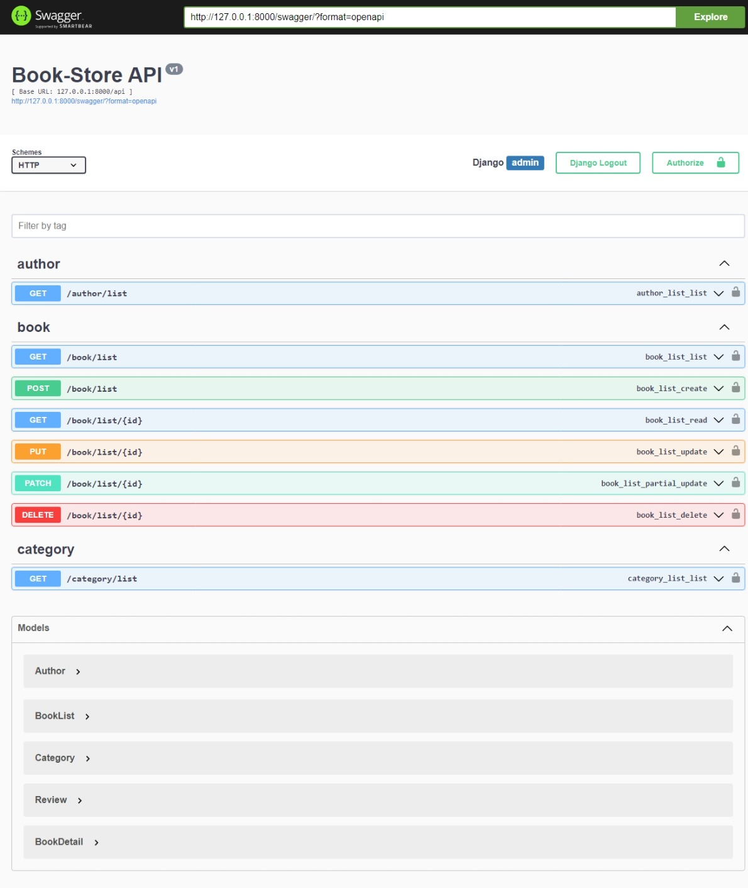

# Bookstore Inventory API

This is a RESTful API for managing a bookstore inventory built with Django and Django REST Framework. The API includes features for filtering books by author, category, and price, ordering books by title, price, and stock, and applying pagination. Swagger is used for API documentation.

## Table of Contents

- [Features](#features)
- [Installation](#installation)
- [Configuration](#configuration)
- [Usage](#usage)
- [API Endpoints](#api-endpoints)
- [Filtering and Ordering](#filtering-and-ordering)
- [Pagination](#pagination)
- [Contributing](#contributing)


## Features

- List all books
- Add a new book
- Retrieve, update, and delete a specific book
- List all authors
- List all categories
- Filter books by author, category, and price
- Order books by title, price, and stock
- Pagination for book listings

## Installation

### Prerequisites

- Python 3.x
- pip
- virtualenv (optional, but recommended)

### Clone the Repository

```sh
git clone https://github.com/Mohamed-Taha-Essa/django-bookstore-inventory.git
cd bookstore-inventory-api
```

### Set Up Virtual Environment (Optional but Recommended)

```sh
python -m venv env
source env/bin/activate  # On Windows use `env\Scripts\activate`
```

### Install Dependencies

```sh
pip install -r requirements.txt
```

### Apply Migrations

```sh
python manage.py migrate
```

### Create a Superuser

```sh
python manage.py createsuperuser
```

### Run the Development Server

```sh
python manage.py runserver
```

## Configuration

### Environment Variables

Create a `.env` file in the root directory and add any necessary environment variables, such as database configuration, secret keys, etc.

Example:

```env
SECRET_KEY=your_secret_key
DEBUG=True
DATABASE_URL=sqlite:///db.sqlite3
```

### Swagger Configuration 



Swagger documentation is automatically generated and available at `/swagger/` once the server is running.

## Usage

### Running the Application

To start the application, use the following command:

```sh
python manage.py runserver
```

### Accessing the Admin Panel

Navigate to `http://localhost:8000/admin` and log in with your superuser credentials.

### Accessing Swagger Documentation

Navigate to `http://localhost:8000/swagger/` to view the API documentation.

## API Endpoints

### Books

- `GET /api/book/list` - List all books
- `POST /api/book/list` - Add a new book
- `GET /api/book/list/<int:pk>` - Retrieve a specific book
- `PUT /api/book/list/<int:pk>` - Update a specific book
- `DELETE /api/book/list/<int:pk>` - Delete a specific book

### Authors

- `GET /api/author/list` - List all authors

### Categories

- `GET /api/category/list` - List all categories

## Filtering and Ordering

You can filter the books by author, category, and price, and order by title, price, and stock using query parameters.

### Filtering

- Filter by author: `GET /api/book/list?author=author_name`
- Filter by category: `GET /api/book/list?category=category_name`
- Filter by price range: `GET /api/book/list?min_price=10&max_price=50`

### Ordering

- Order by title: `GET /api/book/list?ordering=title`
- Order by price: `GET /api/book/list?ordering=price`
- Order by stock: `GET /api/book/list?ordering=stock`

To reverse the order, prefix the field with a minus sign (`-`):

- Reverse order by title: `GET /api/book/list?ordering=-title`
- Reverse order by price: `GET /api/book/list?ordering=-price`
- Reverse order by stock: `GET /api/book/list?ordering=-stock`

## Pagination

Pagination is applied to the book listing endpoint to handle large sets of data. Use the following query parameters to navigate through pages:

- `GET /api/book/list?page=1` - Get the first page of results
- `GET /api/book/list?page_size=10` - Set the number of results per page (default is 10)

### Example

To get the second page of books ordered by price in descending order:

```http
GET /api/book/list?ordering=-price&page=2
```

## Contributing

1. Fork the repository.
2. Create a new branch (`git checkout -b feature-branch`).
3. Make your changes.
4. Commit your changes (`git commit -am 'Add new feature'`).
5. Push to the branch (`git push origin feature-branch`).
6. Open a pull request.

